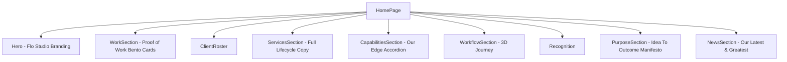

# Flo Studio Website Redesign Implementation Plan

> **For agentic workers:** REQUIRED SUB-SKILL: Use superpowers:subagent-driven-development to implement this plan task-by-task. Steps use checkbox (`- [ ]`) syntax for tracking.

**Goal:** Transform the website into Flo Studio with updated Proof of Work cards, Services copy, new Capabilities ("Our Edge") accordion component, Manifesto About Us ("Idea To Outcome"), and Blog Preview ("Our Latest & Greatest").

**Architecture:**
- Create a dedicated `CapabilitiesSection` component with interactive accordion state.
- Update `WorkSection` with Darkroom-style interactive cards and new headline.
- Update copy in `ServicesSection`, `PurposeSection` (About Us), and `NewsSection` (Blog Preview).
- Update site branding across `Header`, `Hero`, and `index.html` to Flo.
- Integrate into `HomePage.jsx` preserving the 3D `WorkflowSection`.

**Architecture Diagram:**

**Tech Stack:** React 19, Vite 8, GSAP (ScrollTrigger), Framer Motion, Vanilla CSS.

## Global Constraints
- Do not remove existing functional routes (`/work`, `/services`, `/about`, `/latest`).
- Preserve the 3D plane journey (`WorkflowSection`).
- Match typography, layout, and copy verbatim from user's provided specification and reference images.

---

### Task 1: Flo Branding & Global Header/Hero Update
**Files:**
- Modify: `index.html`
- Modify: `src/components/Header.jsx`
- Modify: `src/components/Hero.jsx`

- [ ] **Step 1: Update index.html title & meta**
  - Set `<title>Flo | Creative & Tech Studio</title>`
- [ ] **Step 2: Update Header.jsx with FLO logo wordmark**
  - Replace "INSTRUMENT" logo SVG with modern minimalist "FLO" text/SVG wordmark.
- [ ] **Step 3: Update Hero.jsx statement**
  - Align Hero statement with Flo creative & tech studio positioning.

---

### Task 2: Proof of Work Section Redesign
**Files:**
- Modify: `src/components/WorkSection.jsx`
- Modify: `src/components/WorkSection.css`

- [ ] **Step 1: Update Section Headline**
  - Set headline: `"We're A Creative & Tech Studio Built At The Intersection Of Content And Technical INFRASTRUCTURE."`
- [ ] **Step 2: Darkroom-Style Grid Enhancements**
  - Add Darkroom-inspired statement/feature cards:
    - `"We design digital experiences"` card with minimal wireframe graphic.
    - `"We invest in the future of commerce & content"` spotlight card.
  - Apply bento card styling, refined border-radii (`16px`/`20px`), subtle dark/light contrast cards, tags, and hover state transitions.

---

### Task 3: Services Section Copy Refresh
**Files:**
- Modify: `src/components/ServicesSection.jsx`

- [ ] **Step 1: Update Headline & Description**
  - Headline: `"We Make Brands, Products, Websites, And Establish Creators."`
  - Description: `"We Work Across The Full Lifecycle, Start To Finish, So Every Piece Lands As One Coherent Outcome."`
- [ ] **Step 2: Verify visual carousel behavior and CTA link**

---

### Task 4: New Capabilities Section ("Our Edge" Accordion)
**Files:**
- Create: `src/components/CapabilitiesSection.jsx`
- Create: `src/components/CapabilitiesSection.css`

- [ ] **Step 1: Implement Accordion Component**
  - Section label: `"OUR EDGE"`
  - Main heading: `"WE CREATE POWERFUL BRANDS, SEAMLESS DIGITAL EXPERIENCES, AND RESPONSIVE, DEVICE-READY WEBSITES."`
  - 4 accordion items with expandable state:
    1. **Narrative Instinct**: Every piece of content, every product, every user interaction lives or dies by whether it holds attention and earns trust. Our team doesn't start with execution — we start with instinct for what actually resonates, then build backward from there. It's the same instinct whether we're scripting a video or designing a product flow.
    2. **Stage-Aware Thinking**: A 5K-subscriber creator and a 500K-subscriber creator need different strategies. A pre-funded founder and a funded one need different priorities. Nothing we do is templated — every decision starts with understanding exactly where you are right now, not where a generic playbook assumes you are.
    3. **Cross-Disciplinary Execution**: Strategists, writers, designers, developers, editors, and technical architects — working from the same brief, not handed off between silos. When the same team understands both the creative and technical sides of a problem, nothing gets lost in translation.
    4. **Ownership Through Completion**: We don't disappear after the deliverable ships. Whether it's a piece of content going live or a product hitting the market, our team stays close enough to see how it actually performs — and adjusts from there.
  - Interactive icons: `+` for collapsed, `×` for expanded.
  - Smooth animation on expand/collapse.
- [ ] **Step 2: Style matching Figma Layout**
  - Crisp divider lines, bold uppercase titles, clean responsive spacing, dark/light theme integration.

---

### Task 5: About Us Section ("Idea To Outcome" Manifesto)
**Files:**
- Modify: `src/components/PurposeSection.jsx`
- Modify: `src/components/PurposeSection.css`

- [ ] **Step 1: Update Section Label & Giant Headline**
  - Section label: `"About Us"`
  - Giant tagline: `"Idea To Outcome."`
- [ ] **Step 2: Update Two Manifesto Paragraphs**
  - First paragraph: `"Most Good Ideas Die In The Space Between Vision And Execution. We Built Flo To Close That Gap. Whether We're Growing A Channel Or Building A Product, The Same Team Stays With The Work From The First Idea To The Moment It Lives In The World — And Keeps Refining Once It's Out There."`
  - Second paragraph: `"That Means Owning Every Stage With The Same Team: The Instinct For What Holds Attention, The Clarity For Where You Actually Stand, The Craft To Execute Across Disciplines, And The Ownership To Stay Until It Performs. We Measure Success By What Ships And What Grows, Not By What Gets Delivered And Left Behind."`

---

### Task 6: Blog Preview Section ("Our Latest & Greatest")
**Files:**
- Modify: `src/components/NewsSection.jsx`

- [ ] **Step 1: Update Headline**
  - Subhead / headline: `"Our Latest & Greatest"`
  - Section title: `"News & Noteworthy"`

---

### Task 7: Assemble Page & End-to-End Verification
**Files:**
- Modify: `src/pages/HomePage.jsx`

- [ ] **Step 1: Insert `<CapabilitiesSection />` into HomePage**
  - Place between `ServicesSection` and `WorkflowSection`.
- [ ] **Step 2: Run build and verify in browser**
  - Run `npm run build` or check dev server output for zero errors.
  - Visual verification of layout, accordion interaction, and typography.
