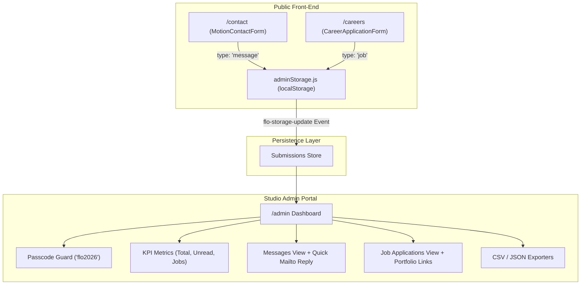

# Flo Studios Admin Section & Careers System Implementation Plan

> **For agentic workers:** REQUIRED SUB-SKILL: Use superpowers:subagent-driven-development to implement this plan task-by-task. Steps use checkbox (`- [ ]`) syntax for tracking.

**Goal:** Build a complete client-side Studio Admin Portal (`/admin`) with PIN passcode protection to manage incoming client inquiries and job applications, backed by an autonomous local storage engine (`adminStorage.js`) and paired with a dedicated studio Careers page (`/careers`).

**Architecture:** A reactive localStorage service (`adminStorage.js`) serves as the single source of truth for all form submissions, broadcasting window events (`flo-storage-update`) so that submissions from `/contact` and `/careers` immediately populate the `/admin` dashboard. The admin portal features a passcode guard (`flo2026`), metrics summary, tabbed inquiry/job tables, search/filter controls, status changers, `mailto:` reply actions, and CSV/JSON export.

**Architecture Diagram:**

**Tech Stack:** React 18, React Router v6, Framer Motion, GSAP, CSS3 Custom Properties.

## Global Constraints
- Zero external backend or third-party tracking required — 100% self-contained client-side persistence with localStorage.
- Initial seed data must provide realistic Flo Studios project inquiries and applicant resumes out of the box.
- All styles must match Flo Studios' Awwwards-caliber dark obsidian & glassmorphism aesthetic.
- Must build cleanly with `npm run build` (0 errors).

---

### Task 1: Reactive Local Storage Engine (`src/services/adminStorage.js`)

**Files:**
- Create: `src/services/adminStorage.js`

**Interfaces:**
- Produces: `getSubmissions()`, `saveSubmission(sub)`, `updateSubmissionStatus(id, status)`, `toggleStar(id)`, `deleteSubmission(id)`, `exportToCSV()`, `exportToJSON()`, `seedSampleData()`

- [ ] **Step 1: Write `src/services/adminStorage.js`**
  - Implement default seed data with 3 realistic brand inquiries (e.g. Apple visionOS 3D motion, Nike brand campaign, Blitzit tech reveal) and 3 realistic job applications (Senior 3D Artist, Motion Director, WebGL Engineer).
  - Implement localStorage read/write with error fallback.
  - Implement `window.dispatchEvent(new CustomEvent('flo-storage-update'))` on any mutation.
  - Implement CSV and JSON blob generation and download triggers.

- [ ] **Step 2: Commit Task 1**
  - `git add src/services/adminStorage.js && git commit -m "feat: implement reactive admin storage engine with seed data and export tools"`

---

### Task 2: Connect Contact Page Submissions to Storage Engine

**Files:**
- Modify: `src/components/MotionContactForm.jsx`

**Interfaces:**
- Consumes: `saveSubmission` from `src/services/adminStorage.js`

- [ ] **Step 1: Update `MotionContactForm.jsx`**
  - In `handleSubmit`, call `saveSubmission({ type: 'message', name, email, phone, service: selectedService, message })`.
  - Ensure the record is persisted right before the 3D mailbox delivery animation starts.

- [ ] **Step 2: Commit Task 2**
  - `git add src/components/MotionContactForm.jsx && git commit -m "feat: persist contact inquiries to admin storage engine"`

---

### Task 3: Build Dedicated Careers Page (`src/pages/CareersPage.jsx` & `CareersPage.css`)

**Files:**
- Create: `src/pages/CareersPage.jsx`
- Create: `src/pages/CareersPage.css`
- Modify: `src/App.jsx` (register `/careers` route)
- Modify: `src/pages/AboutPage.jsx` (update Careers CTA button to link to `/careers`)

**Interfaces:**
- Consumes: `saveSubmission` from `src/services/adminStorage.js`

- [ ] **Step 1: Implement `src/pages/CareersPage.jsx`**
  - Hero section with Flo Studios culture, remote-first manifesto, benefits.
  - Open positions accordion / directory (*Senior 3D & Procedural Artist*, *Motion Art Director*, *Creative Technologist / WebGL*, *Brand & Visual Identity Designer*).
  - Career Application Form card: Name, Email, Phone, Role dropdown, Portfolio URL, Years of Experience, Motivation / Cover note.
  - On submit: calls `saveSubmission({ type: 'job', ... })`, provides spring-animated success confirmation.

- [ ] **Step 2: Style `src/pages/CareersPage.css`**
  - Responsive layout, obsidian cards, role tags, and styled inputs matching `/contact`.

- [ ] **Step 3: Route & Navigation integration**
  - Add `<Route path="/careers" element={<CareersPage />} />` in `src/App.jsx`.
  - Update `AboutPage.jsx`'s Careers link from `/contact` to `/careers`.

- [ ] **Step 4: Commit Task 3**
  - `git add src/pages/CareersPage.jsx src/pages/CareersPage.css src/App.jsx src/pages/AboutPage.jsx && git commit -m "feat: add dedicated careers page with job application form and open roles"`

---

### Task 4: Build Studio Admin Dashboard (`src/pages/AdminPage.jsx` & `AdminPage.css`)

**Files:**
- Create: `src/pages/AdminPage.jsx`
- Create: `src/pages/AdminPage.css`
- Modify: `src/App.jsx` (register `/admin` route)

**Interfaces:**
- Consumes: `getSubmissions`, `updateSubmissionStatus`, `toggleStar`, `deleteSubmission`, `exportToCSV`, `exportToJSON`, `seedSampleData` from `src/services/adminStorage.js`

- [ ] **Step 1: Implement Passcode Guard**
  - Sleek modal requiring PIN `flo2026`.
  - Includes "Unlock Demo" quick button for zero-friction access.
  - Remembers unlock status in `sessionStorage`.

- [ ] **Step 2: Implement Admin Dashboard Shell & Metrics**
  - Top bar with studio badge, live timestamp, lock session button, CSV/JSON export buttons, and "Add Sample Data" button.
  - 4 KPI cards: Total Submissions, Unread Messages, Active Job Applications, Action Required.

- [ ] **Step 3: Implement Tabbed Feed & Detail View**
  - Tab Switcher: **All Inquiries**, **Client Messages**, **Job Applications**.
  - Search input (searches by name, email, role, or message keyword).
  - Filter by status (*All*, *New*, *In Review*, *Replied / Interview*, *Archived*).
  - Record Card:
    - Client message: displays Name, Email, Phone, Service tag, Date, snippet, Star button, Status badge.
    - Job application: displays Name, Email, Role applied, Portfolio link (with clickable external link), Experience badge, Cover note.
    - Quick Action: Direct `mailto:` button with pre-filled subject line.
    - Status changer dropdown (*New*, *Reviewing*, *Interview*, *Replied*, *Archived*).
    - Delete button with confirmation.

- [ ] **Step 4: Style `src/pages/AdminPage.css`**
  - High-end dark studio aesthetic, glassmorphic metric cards, glowing status pills, responsive split view on desktop, clean stacked cards on mobile.

- [ ] **Step 5: Register `/admin` route in `src/App.jsx`**

- [ ] **Step 6: Commit Task 4**
  - `git add src/pages/AdminPage.jsx src/pages/AdminPage.css src/App.jsx && git commit -m "feat: build studio admin portal with passcode guard, KPI metrics, and message/job management"`

---

### Task 5: Add Discreet Footer Link to Admin

**Files:**
- Modify: `src/components/Footer.jsx`
- Modify: `src/components/Footer.css`

- [ ] **Step 1: Update Footer legal / bottom bar**
  - Add a subtle `Admin` link next to copyright (`© 2026 Flo Studios · Admin`).

- [ ] **Step 2: Commit Task 5**
  - `git add src/components/Footer.jsx src/components/Footer.css && git commit -m "feat: add subtle admin portal access link to footer"`

---

### Task 6: Verification & Build Validation

- [ ] **Step 1: Production build test**
  - Run `npm run build` and ensure 0 errors.

- [ ] **Step 2: End-to-end flow test**
  - Submit inquiry on `/contact` -> verify it appears in `/admin` under Messages.
  - Submit application on `/careers` -> verify it appears in `/admin` under Job Applications.
  - Test status update, starring, search, CSV export, and demo unlock.

- [ ] **Step 3: Commit and report completion**
