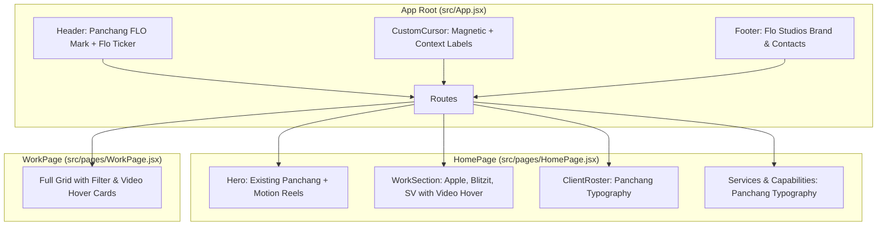

# Site Enhancements: Brand Polish, Motion Showcase, Panchang Typography & Custom Cursor Implementation Plan

> **For agentic workers:** REQUIRED SUB-SKILL: Use superpowers:subagent-driven-development to implement this plan task-by-task. Steps use checkbox (`- [ ]`) syntax for tracking.

**Goal:** Transform Flo Studios website into a cohesive, motion-first creative studio platform by adding a Panchang header mark, purging template artifacts, showcasing real motion projects (Apple, Blitzit, SV) with video hover previews, unifying section typography with Panchang ExtraBold, and introducing an interactive magnetic studio cursor.

**Architecture:** 
1. **Brand Layer (`Header`, `Footer`, `Pages`):** Embed a sticky Panchang `FLO` wordmark into the navigation bar, refresh announcement ticker copy, and update studio locations/social links.
2. **Work Showcase Layer (`WorkSection`, `WorkPage`):** Feature Apple, Blitzit, and SV at the forefront of the project grid with HTML5 video hover preview components that seamlessly cross-fade on mouse enter.
3. **Typography System (`global.css`, Section CSS):** Standardize all major section headers and display labels to use `var(--font-panchang)` with tight kerning and uppercase tracking.
4. **Interaction Layer (`CustomCursor`):** A global custom cursor component mounted at the app root that tracks mouse position and responds dynamically with scaled states and contextual labels (`"PLAY"`, `"EXPLORE"`, `"VIEW"`).

**Architecture Diagram:**

**Tech Stack:** React 19, Vite 8, GSAP 3, CSS Backdrop Filters, Panchang Webfont, HTML5 Video API.

## Global Constraints
- Typography: Panchang ExtraBold (`weight: 800`) for headers, Inter for body/subtitles.
- Videos: `/videos/apple.mov`, `/videos/blitzit2.mov`, `/videos/sv-final.mov` with matching thumbnails in `/videos/`.
- Mobile safety: Custom cursor automatically disables on touch screens via `@media (hover: none)`.
- No broken links: Replace all external `@instrument` placeholders with Flo Studios links (`#`, `/contact`, `/work`).

---

### Task 1: Brand Polish — Add Panchang Header Mark & Clean Up Footer/Announcements

**Files:**
- Modify: `src/components/Header.jsx`
- Modify: `src/components/Header.css`
- Modify: `src/components/Footer.jsx`
- Modify: `src/components/Footer.css`

**Interfaces:**
- Produces: Header with persistent `FLO` mark in Panchang ExtraBold; refreshed announcements ticker; footer with Flo Studios branding, modern locations, and working navigation.

- [ ] **Step 1: Update `Header.jsx` and `Header.css`**
  - Add a `<Link to="/" className="site-header__logo">FLO</Link>` styled in Panchang ExtraBold.
  - Update `ANNOUNCEMENTS` array with Flo Studios motion & creative technology achievements.
  - Style logo with hover transition and ensure balanced flex layout with existing navigation pills.

- [ ] **Step 2: Update `Footer.jsx` and `Footer.css`**
  - Replace Instrument SVG mark with `FLO STUDIOS` Panchang wordmark.
  - Update marquee copy to reflect Flo Studios motion graphics and creative technology focus.
  - Replace Portland address with modern studio presence (e.g. Los Angeles, CA / Remote Global).
  - Replace Twitter `@instrument` with social links (`Instagram`, `Twitter/X`, `Vimeo`, `LinkedIn`).

- [ ] **Step 3: Verify build and commit**
  - Run: `npm run build`
  - Commit: `feat: add Panchang header logo and update branding across header and footer`

---

### Task 2: Typography — Apply Panchang ExtraBold Across All Section Headers

**Files:**
- Modify: `src/styles/global.css`
- Modify: `src/components/WorkSection.css`
- Modify: `src/components/ClientRoster.css`
- Modify: `src/components/ServicesSection.css`
- Modify: `src/components/CapabilitiesSection.css`
- Modify: `src/components/Recognition.css`
- Modify: `src/components/PurposeSection.css`
- Modify: `src/components/NewsSection.css`
- Modify: `src/pages/Pages.css`

**Interfaces:**
- Produces: Consistent editorial studio aesthetic with Panchang ExtraBold headers across homepage and subpages.

- [ ] **Step 1: Update section headings in component CSS files**
  - Apply `font-family: var(--font-panchang); font-weight: 800; text-transform: uppercase; letter-spacing: -0.015em;` to:
    - `.work-section__title`
    - `.client-roster__label`
    - `.services-section__title`
    - `.capabilities-section__title`
    - `.recognition__title`
    - `.purpose-section__title`
    - `.news-section__title`
    - `.page-hero__title` in `Pages.css`

- [ ] **Step 2: Verify build and layout**
  - Run: `npm run build`
  - Commit: `style: apply Panchang ExtraBold typography to all major section headers`

---

### Task 3: Showcase Real Work — Feature Apple, Blitzit, and SV in Work Grid with Video Hover Previews

**Files:**
- Modify: `src/components/WorkSection.jsx`
- Modify: `src/components/WorkSection.css`
- Modify: `src/pages/WorkPage.jsx`

**Interfaces:**
- Consumes: Video and thumbnail assets from `/videos/`
- Produces: Interactive case study cards that play looping video clips on hover.

- [ ] **Step 1: Update `WorkSection.jsx` and `WorkSection.css`**
  - Add Apple, Blitzit, and SV to the top of `WORK_ITEMS` with `videoSrc`, `image`, `tags: ['motion', 'product']`, metrics, and client names.
  - Implement a `WorkCard` subcomponent or inline card with hover state: on mouse enter, renders an unmuted/muted preview `<video autoPlay loop muted playsInline>` with smooth fade-in over the poster image.
  - Add category filter pill for `'motion'` in work filtering.

- [ ] **Step 2: Update `WorkPage.jsx`**
  - Mirror the real motion graphics case studies and video hover capabilities on the dedicated `/work` page.

- [ ] **Step 3: Verify video hover playback and build**
  - Run: `npm run build`
  - Commit: `feat: showcase Apple, Blitzit, and SV in Work sections with video hover previews`

---

### Task 4: Interactive Studio Cursor — Magnetic Physics & Contextual Labels

**Files:**
- Create: `src/components/CustomCursor.jsx`
- Create: `src/components/CustomCursor.css`
- Modify: `src/App.jsx`

**Interfaces:**
- Produces: Global custom cursor that smoothly follows mouse movement, scales over clickable elements, and displays contextual action tags (`"WATCH"`, `"EXPLORE"`, `"VIEW"`).

- [ ] **Step 1: Create `src/components/CustomCursor.jsx`**
  - Track mouse coordinates with high performance (via `requestAnimationFrame` or `gsap.quickTo`).
  - Detect hovered element type via `data-cursor` attributes (e.g. `data-cursor="PLAY"`, `data-cursor="EXPLORE"`).
  - Render trailing outer ring and inner dot with smooth easing.

- [ ] **Step 2: Style `src/components/CustomCursor.css`**
  - Modern dark/light glassmorphic cursor with blend-mode: difference.
  - Styled label text in clean typography.
  - `@media (hover: none)` disables cursor on touch devices to ensure native mobile UX is untouched.

- [ ] **Step 3: Mount `CustomCursor` in `src/App.jsx` and annotate key components**
  - Mount `<CustomCursor />` inside `App.jsx`.
  - Add `data-cursor="WATCH"` to Hero video card, `data-cursor="EXPLORE"` to Work cards.

- [ ] **Step 4: Verify build and commit**
  - Run: `npm run build`
  - Commit: `feat: implement interactive magnetic custom studio cursor`

---

### Task 5: Final Review & Polish

- [ ] **Step 1: Test all interactive features end-to-end at `http://localhost:5173/`**
- [ ] **Step 2: Ensure responsive mobile layout on small viewports**
- [ ] **Step 3: Final git commit and summary**
