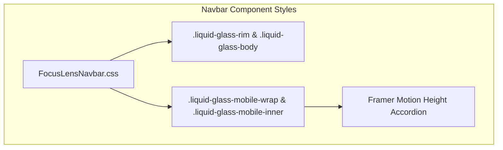

# Navbar 50% Transparency & Direct Square Mobile Navigation Implementation Plan

> **For agentic workers:** REQUIRED SUB-SKILL: Use superpowers:subagent-driven-development to implement this plan task-by-task. Steps use checkbox (`- [ ]`) syntax for tracking.

**Goal:** Calibrate the liquid-glass navbar to 50% transparency across desktop and mobile, and ensure the mobile navigation opens directly as a square accordion box without circular pill morphing.

**Architecture:** Update the CSS rules in [FocusLensNavbar.css](file:///c:/Users/hashi/Documents/MCP%20projects/new%20site/src/components/FocusLensNavbar.css) controlling the desktop and mobile liquid glass gradients to 50% alpha, retaining `backdrop-filter: blur(28px) saturate(180%)`. Replace the mobile navbar's `border-radius: 9999px` and `transition: border-radius 0.3s ease;` with a steady `border-radius: 18px` in both closed and open states so Framer Motion's height expansion operates strictly on a rounded rectangle.

**Architecture Diagram:**



**Tech Stack:** React 19, Vite, Framer Motion, Vanilla CSS.

## Global Constraints
- Typography, brand logo, and CTA button text must remain at 100% opacity (`#0e0e12` and `#ffffff`) for AAA contrast.
- Desktop liquid glass rim and body must preserve backdrop blur (`blur(28px)`).
- Mobile navbar must maintain a consistent `border-radius: 18px` across both closed and open states.

---

### Task 1: Calibrate Desktop and Mobile Liquid Glass to 50% Transparency

**Files:**
- Modify: `c:/Users/hashi/Documents/MCP projects/new site/src/components/FocusLensNavbar.css:30-85, 260-305`

**Interfaces:**
- Consumes: CSS class definitions for `.liquid-glass-rim`, `.liquid-glass-body`, `.liquid-glass-mobile-wrap`, `.liquid-glass-mobile-inner`.
- Produces: 50% alpha translucent gradients with frosted glass backdrop blur.

- [ ] **Step 1: Update desktop glass rim and body background alpha**

In `src/components/FocusLensNavbar.css`:
Adjust `.liquid-glass-rim` gradient opacity from ~0.90 to ~0.50.
Adjust `.liquid-glass-body` gradient opacity from ~0.88 to ~0.50.

```diff
 .liquid-glass-rim {
   pointer-events: auto;
   position: relative;
   width: 100%;
   max-width: 940px;
   display: flex;
   align-items: center;
   padding: 2.5px;
   border-radius: 9999px;
   background: linear-gradient(
     180deg,
-    rgba(255, 255, 255, 0.98) 0%,
-    rgba(215, 218, 224, 0.88) 9%,
-    rgba(175, 180, 190, 0.75) 32%,
-    rgba(125, 130, 142, 0.72) 73%,
-    rgba(255, 255, 255, 0.98) 100%
+    rgba(255, 255, 255, 0.55) 0%,
+    rgba(215, 218, 224, 0.48) 9%,
+    rgba(175, 180, 190, 0.42) 32%,
+    rgba(125, 130, 142, 0.38) 73%,
+    rgba(255, 255, 255, 0.55) 100%
   );
```

```diff
 .liquid-glass-body {
   position: relative;
   width: 100%;
   display: flex;
   align-items: center;
   justify-content: space-between;
   padding: 3px 10px 3px 14px;
   border-radius: 9999px;
   background: linear-gradient(
     150deg,
-    rgba(235, 238, 243, 0.84) 0%,
-    rgba(252, 253, 255, 0.92) 50.17%,
-    rgba(228, 232, 238, 0.82) 100%
+    rgba(235, 238, 243, 0.48) 0%,
+    rgba(252, 253, 255, 0.52) 50.17%,
+    rgba(228, 232, 238, 0.48) 100%
   );
   -webkit-backdrop-filter: blur(28px) saturate(180%);
   backdrop-filter: blur(28px) saturate(180%);
```

- [ ] **Step 2: Update mobile glass rim and inner background alpha**

Adjust `.liquid-glass-mobile-wrap` gradient and `.liquid-glass-mobile-inner` gradient to 50% opacity:

```diff
 .liquid-glass-mobile-wrap {
   display: none;
   pointer-events: auto;
   position: relative;
   width: 100%;
   padding: 2.5px;
   background: linear-gradient(
     180deg,
-    rgba(255, 255, 255, 0.98) 0%,
-    rgba(215, 218, 224, 0.88) 9%,
-    rgba(175, 180, 190, 0.75) 32%,
-    rgba(125, 130, 142, 0.72) 73%,
-    rgba(255, 255, 255, 0.98) 100%
+    rgba(255, 255, 255, 0.55) 0%,
+    rgba(215, 218, 224, 0.48) 9%,
+    rgba(175, 180, 190, 0.42) 32%,
+    rgba(125, 130, 142, 0.38) 73%,
+    rgba(255, 255, 255, 0.55) 100%
   );
```

```diff
 .liquid-glass-mobile-inner {
   position: relative;
   width: 100%;
   background: linear-gradient(
     150deg,
-    rgba(238, 240, 245, 0.92) 0%,
-    rgba(255, 255, 255, 0.96) 50%,
-    rgba(232, 235, 242, 0.92) 100%
+    rgba(238, 240, 245, 0.48) 0%,
+    rgba(255, 255, 255, 0.52) 50%,
+    rgba(232, 235, 242, 0.48) 100%
   );
   -webkit-backdrop-filter: blur(28px) saturate(180%);
   backdrop-filter: blur(28px) saturate(180%);
```

---

### Task 2: Eliminate Circle Morphing & Enforce Direct Square Mobile Drawer

**Files:**
- Modify: `c:/Users/hashi/Documents/MCP projects/new site/src/components/FocusLensNavbar.css:262, 276-283`

**Interfaces:**
- Consumes: `.liquid-glass-mobile-wrap`, `.liquid-glass-mobile-wrap--open`.
- Produces: Constant rounded square container geometry (`border-radius: 18px`) without radius interpolation.

- [ ] **Step 1: Set constant 18px border radius on mobile navbar container**

In `src/components/FocusLensNavbar.css`:
Change `.liquid-glass-mobile-wrap` `border-radius: 9999px` to `border-radius: 18px`.
Remove `transition: border-radius 0.3s ease;`.
Set `.liquid-glass-mobile-wrap--open` to `border-radius: 18px;`.

```diff
 .liquid-glass-mobile-wrap {
   display: none;
   pointer-events: auto;
   position: relative;
   width: 100%;
   padding: 2.5px;
-  border-radius: 9999px;
+  border-radius: 18px;
   background: linear-gradient(
...
   box-shadow: 
     0.48px 7.24px 3.63px 0px rgba(0, 0, 0, 0.02),
     1.28px 19.15px 9.6px 0px rgba(0, 0, 0, 0.035),
     4px 60px 30.07px 0px rgba(0, 0, 0, 0.1);
   overflow: hidden;
-  transition: border-radius 0.3s ease;
   box-sizing: border-box;
 }
 
 .liquid-glass-mobile-wrap--open {
-  border-radius: 20px;
+  border-radius: 18px;
 }
```

---

### Task 3: Build & Visual Verification

**Files:**
- Test/Verify: `src/components/FocusLensNavbar.css`

- [ ] **Step 1: Verify production build succeeds**

Run: `npm run build`
Expected: `vite build` passes with exit code 0.

- [ ] **Step 2: Inspect running server on desktop and mobile viewports**

Verify via browser:
- On desktop (> 860px): Background is 50% transparent frosted glass, hero content blurs beneath navbar.
- On mobile (<= 860px): Bar starts as an 18px rounded rectangle, click MENU -> smoothly accordion-expands downward as a square with no circle/oval distortion.
