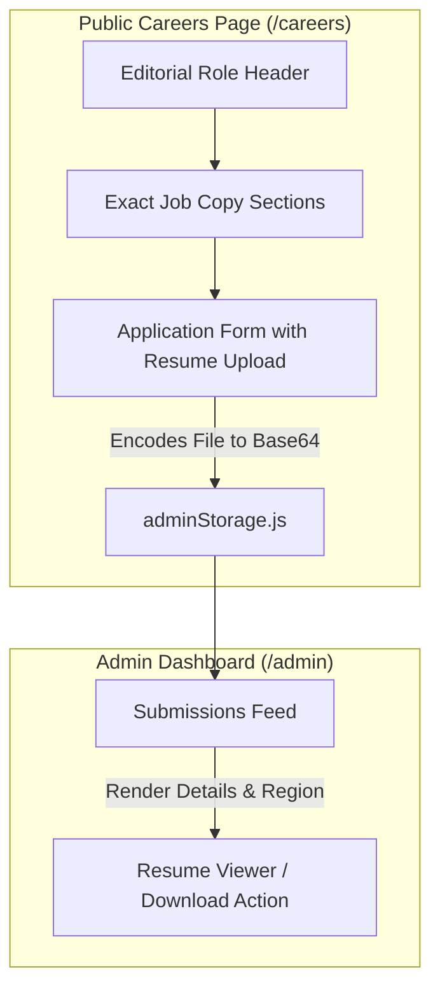

# Sales Development Representative Careers Page Implementation Plan

> **For agentic workers:** REQUIRED SUB-SKILL: Use superpowers:subagent-driven-development to implement this plan task-by-task. Steps use checkbox (`- [ ]`) syntax for tracking.

**Goal:** Rebuild the Flo Studios Careers page (`/careers`) to strictly display the **Sales Development Representative** job listing verbatim with no foreign filler, add client-side resume upload, enable resume viewing in the admin portal (`/admin`), and completely purge all dummy/demo records.

**Architecture:** The page is built as a React 19 component (`CareersPage.jsx`) styled via dedicated CSS (`CareersPage.css`). Job applications including base64-encoded resume files are saved to browser storage via `adminStorage.js` and viewed/downloaded in `AdminPage.jsx`.

**Architecture Diagram:**



**Tech Stack:** React 19, React Router v7, Framer Motion, GSAP, CSS Variables, HTML5 FileReader API, LocalStorage.

## Global Constraints
- Only the exact copy provided by the user is allowed on the careers page.
- Do not retain any dummy roles (3D Artist, Motion Director, WebGL Technologist, Brand Designer) or dummy perks.
- Purge all sample inquiries (Maya Lin, Alex Mercer, etc.) from `adminStorage.js`.
- File upload must accept `.pdf`, `.doc`, `.docx` up to 5MB and support download/viewing in the admin portal.

---

### Task 1: Purge Demo Data & Add Resume Storage Support in `adminStorage.js`

**Files:**
- Modify: `src/services/adminStorage.js`

**Interfaces:**
- Consumes: Submission objects with `resumeName`, `resumeSize`, `resumeType`, `resumeData`, `region`.
- Produces: `getSubmissions()`, `saveSubmission(entry)`, `exportToCSV()`, `exportToJSON()`.

- [ ] **Step 1: Update `adminStorage.js` to clear seeds and support resume storage**
  - Set `DEFAULT_SEEDS = []`.
  - In `getSubmissions()`, filter out or purge any legacy sample data with IDs like `msg_172783680...` or `job_172783690...`.
  - Ensure `saveSubmission` saves `resumeName`, `resumeSize`, `resumeType`, `resumeData`, and `region`.
  - In `exportToCSV()`, add `Region` and `Resume Attached` columns.

- [ ] **Step 2: Verify in shell using node or checking file integrity**
  - Verify syntax and exports of `src/services/adminStorage.js`.

- [ ] **Step 3: Commit**
  ```bash
  git add src/services/adminStorage.js
  git commit -m "feat(storage): purge demo data and add resume storage fields"
  ```

---

### Task 2: Rebuild Careers Page with Strict Job Copy & Resume Upload

**Files:**
- Modify: `src/pages/CareersPage.jsx`
- Modify: `src/pages/CareersPage.css`

**Interfaces:**
- Consumes: `saveSubmission` from `../services/adminStorage`.
- Produces: Interactive `/careers` page strictly rendering:
  1. Breadcrumbs & Header: `Sales Development Representative`, `Development Division`, meta tags.
  2. About Flo Studios (verbatim).
  3. About the Job (verbatim).
  4. Responsibilities (9 items verbatim).
  5. Compensation (12-15%, deal sizes $5k-$100k+, illustrative examples, onboarding terms).
  6. Minimum Qualifications (strict 2-3 years, tech industry, full cycle, NA/Europe) & Preferred Qualifications.
  7. What Success Looks Like (verbatim).
  8. You Might Thrive in this Role (6 points verbatim).
  9. Mission & Equal Opportunity Employer (verbatim).
  10. Application Form:
      - Full Name, Email, Phone
      - Region dropdown (`North America`, `Europe`, `Other region`)
      - Experience dropdown (`2-3 years (Meets qualification)`, `Less than 2 years`, `More than 3 years`)
      - Profile/LinkedIn URL
      - Resume Upload: File drag/drop or picker, size validation (< 5MB), FileReader conversion to Base64, display filename and clear option.
      - Sales Background / Fit notes
      - Required Checkbox: Verbatim **Note\*** confirmation text.
      - Dispatches real data without mock fallback defaults.

- [ ] **Step 1: Implement `src/pages/CareersPage.jsx`**
  - Embed the exact verbatim text for all sections.
  - Implement resume file handling using `FileReader.readAsDataURL()`.
  - Wire up form submission to `saveSubmission()`.

- [ ] **Step 2: Update `src/pages/CareersPage.css`**
  - Implement full-width editorial layout matching Flo Studios' typography (`Space Grotesk`, `Hanken Grotesk`).
  - Style metadata badges, qualification highlights, compensation callout box, and resume upload dropzone.

- [ ] **Step 3: Commit**
  ```bash
  git add src/pages/CareersPage.jsx src/pages/CareersPage.css
  git commit -m "feat(careers): redesign careers page with verbatim SDR job listing and resume upload"
  ```

---

### Task 3: Admin Dashboard Resume Viewing & Downloads

**Files:**
- Modify: `src/pages/AdminPage.jsx`

**Interfaces:**
- Consumes: Submissions containing `resumeData`, `resumeName`, `region`.
- Produces: Action button to view or download resume, display of applicant region badge, clean empty state when no submissions exist.

- [ ] **Step 1: Update `src/pages/AdminPage.jsx`**
  - Add resume download/view button:
    ```jsx
    {item.resumeData && (
      <a
        href={item.resumeData}
        download={item.resumeName || 'Resume.pdf'}
        className="admin-btn admin-btn--resume"
        target="_blank"
        rel="noopener noreferrer"
      >
        📄 View / Download Resume ({item.resumeName})
      </a>
    )}
    ```
  - Display applicant's region: `{item.region && <span className="admin-card__region-badge">📍 {item.region}</span>}`.
  - Update empty state copy to be clean.

- [ ] **Step 2: Update `src/pages/AdminPage.css` (if needed for resume button styling)**
  - Ensure the resume button is styled cleanly within `.admin-card__footer` or details section.

- [ ] **Step 3: Commit**
  ```bash
  git add src/pages/AdminPage.jsx src/pages/AdminPage.css
  git commit -m "feat(admin): add resume viewing and download capabilities"
  ```

---

### Task 4: Build Verification & End-to-End Testing

**Files:**
- Verify: Full project build

- [ ] **Step 1: Run production build**
  ```powershell
  npm run build
  ```
  Expected: Clean build with zero compilation or lint errors.

- [ ] **Step 2: Verify copy and functionality**
  - Verify every section matches the user's provided text word for word.
  - Verify that no old dummy roles or perks exist.
  - Verify clean admin state.

- [ ] **Step 3: Commit final updates if any**
