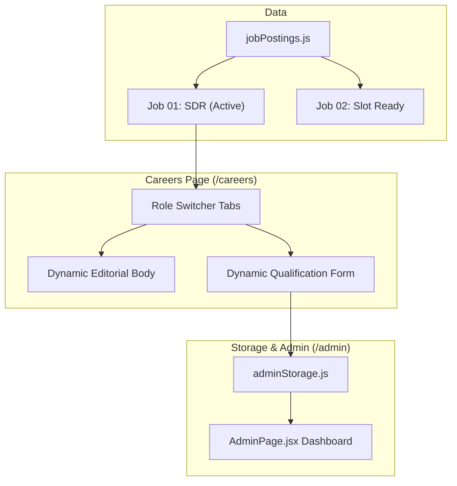

# Multi-Job Careers Architecture Implementation Plan

> **For agentic workers:** REQUIRED SUB-SKILL: Use superpowers:subagent-driven-development to implement this plan task-by-task. Steps use checkbox (`- [ ]`) syntax for tracking.

**Goal:** Establish a modular multi-job architecture on `/careers` with active Job #1 (Sales Development Representative) verbatim copy and role switcher tabs ready for Job #2.

**Architecture:** Centralize job specifications into a typed/documented data module (`src/data/jobPostings.js`). Refactor `CareersPage.jsx` to dynamically render editorial content and bind the application form to the selected job via accessible studio tabs. Submissions automatically persist the selected job title and division into `adminStorage.js` for the Admin dashboard.

**Architecture Diagram:**



**Tech Stack:** React 19, Vite, Framer Motion, GSAP, CSS Variables, LocalStorage Storage Engine.

## Global Constraints
- Strictly verbatim copy for Job #1 (Sales Development Representative), including updated auto-rejection text.
- Zero mock applicants or fake seed entries.
- File upload limit strictly 5MB (.pdf, .doc, .docx).
- Clean `npm run build` with 0 errors.

---

### Task 1: Create Centralized Job Configuration Module

**Files:**
- Create: `src/data/jobPostings.js`
- Test: `npm run build`

**Interfaces:**
- Produces: `JOB_POSTINGS: Array<JobPosting>` containing full data model for Job 01 (SDR) and structured schema ready for Job 02.

- [ ] **Step 1: Write `src/data/jobPostings.js`**
Write the complete job configuration file with full verbatim copy for Job 01: Sales Development Representative, including the updated Minimum Qualifications clause ("and will be automatically rejected").

- [ ] **Step 2: Run build to verify module exports and syntax**
Run: `npm run build`
Expected: PASS

- [ ] **Step 3: Commit**
```bash
git add src/data/jobPostings.js
git commit -m "feat(careers): create centralized job postings data module"
```

---

### Task 2: Refactor Careers Page to Support Role Switcher Tabs

**Files:**
- Modify: `src/pages/CareersPage.jsx`
- Modify: `src/pages/CareersPage.css`

**Interfaces:**
- Consumes: `JOB_POSTINGS` from `src/data/jobPostings.js`
- Produces: Dynamic editorial view and role-specific form submission payload (`role: activeJob.title`, `division: activeJob.division`).

- [ ] **Step 1: Update `CareersPage.jsx`**
Import `JOB_POSTINGS` from `../data/jobPostings`.
Add state for `activeJobId` (defaults to first job).
Render interactive role switcher tabs (`.careers-tabs`) right below the breadcrumb.
Dynamically render header title, badges, prose sections, responsibilities, compensation items, qualifications, and culture points from `activeJob`.
Bind the form so changing jobs resets errors and sets `role` and `division` dynamically in `saveSubmission`.

- [ ] **Step 2: Update `CareersPage.css`**
Add styles for `.careers-tabs`, `.careers-tab-btn`, `.careers-tab-btn--active`, `.careers-tab-number`, and responsive tab scrolling on mobile.

- [ ] **Step 3: Run build to verify compilation**
Run: `npm run build`
Expected: PASS

- [ ] **Step 4: Commit**
```bash
git add src/pages/CareersPage.jsx src/pages/CareersPage.css
git commit -m "feat(careers): implement role switcher tabs and dynamic job rendering"
```

---

### Task 3: Admin Dashboard Alignment & End-to-End Verification

**Files:**
- Modify (if needed): `src/pages/AdminPage.jsx`
- Test: Manual end-to-end verification via build & storage test

**Interfaces:**
- Consumes: Dynamic job submissions from `adminStorage.js`

- [ ] **Step 1: Verify `AdminPage.jsx` displays dynamic job role tags correctly**
Check that candidate cards show the applied role (`item.role`) badge and handle resume download seamlessly.

- [ ] **Step 2: Run verification build and test suite**
Run: `npm run build`
Expected: PASS with 0 errors.

- [ ] **Step 3: Commit and Push**
```bash
git add .
git commit -m "feat(careers): complete multi-job support with admin sync"
git push origin main
```
