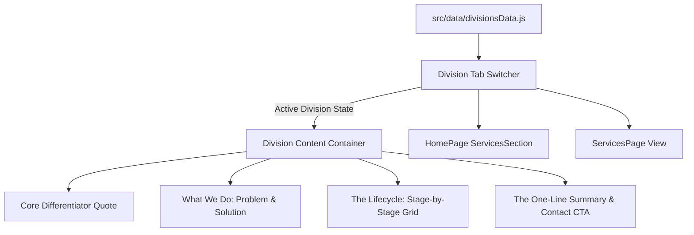

# Two Divisions Services Section Implementation Plan

> **For agentic workers:** REQUIRED SUB-SKILL: Use superpowers:subagent-driven-development to implement this plan task-by-task. Steps use checkbox (`- [ ]`) syntax for tracking.

**Goal:** Implement the new Two-Division Services section (Development Division as primary flagship, Creator / Content Division as secondary) based on verbatim content from `Frame 6Divisions Doc Flo.pdf`, across both the Homepage and the dedicated Services Page.

**Architecture:** A centralized data module (`src/data/divisionsData.js`) stores the exact verbatim content for both divisions. An interactive React component (`ServicesSection.jsx`) provides a segmented tab switcher with animated Framer Motion layout pill, differentiator quote, problem/solution narrative, stage-by-stage lifecycle grid (11 stages for Development, 8 for Creator), and one-line summary callout banner.

**Architecture Diagram:**



**Tech Stack:** React 18, Framer Motion, GSAP ScrollTrigger, CSS3 Grid/Flexbox, Manrope Typography.

## Global Constraints
- Exact verbatim text from `Frame 6Divisions Doc Flo.pdf` for all sections, quotes, stages, and summaries.
- Development Division must be the default active/primary division.
- Typography must strictly use `Manrope` (`var(--font-manrope), 'Manrope', sans-serif`), NEVER `Panchang`.
- Zero layout shifting or build errors.

---

### Task 1: Create Centralized Divisions Data Module (`src/data/divisionsData.js`)

**Files:**
- Create: `src/data/divisionsData.js`

**Interfaces:**
- Produces: `DIVISIONS` array and `getDivisionById(id)` helper function.

- [ ] **Step 1: Write `src/data/divisionsData.js` with complete verbatim text for both divisions**

Includes:
- `id: 'development'`:
  - `name`: 'Development Division'
  - `label`: 'Primary Flagship'
  - `badge`: 'Full Build Lifecycle'
  - `whatWeDo`: problem, solution, philosophy
  - `coreDifferentiator`: title, quote, text
  - `pipelineTitle`: 'The Build Lifecycle: Stage by Stage'
  - `stages`: 11 items (Requirements & Product Planning, Market & Technical Research, Estimation, Proposal & Project Setup, UI/UX Design, Technical Architecture & Development Planning, Development, QA & Testing, Pre-Launch / Release Preparation, Deployment & Launch, Post-Launch Support & Maintenance, Optimization & Continuous Development)
  - `oneLineSummary`: verbatim from PDF
- `id: 'creator'`:
  - `name`: 'Creator / Content Division'
  - `label`: 'Secondary Division'
  - `badge`: 'Integrated Content Pipeline'
  - `whatWeDo`: problem, solution
  - `coreDifferentiator`: title, quote, text
  - `pipelineTitle`: 'The Pipeline: Stage by Stage'
  - `stages`: 8 items (Ideation & Format Development, Scripting, Storyboarding, Post-Production Editing, Sound Design, Packaging Design, Multi-Platform Distribution Planning, Specialized Analysis)
  - `oneLineSummary`: verbatim from PDF

- [ ] **Step 2: Verify syntax with `npm run build`**

Run: `npm run build`
Expected: 0 errors.

- [ ] **Step 3: Commit**

```bash
git add src/data/divisionsData.js
git commit -m "feat(services): add centralized divisions data module from divisions doc"
```

---

### Task 2: Build the Interactive Divisions Services Component & CSS

**Files:**
- Modify: `src/components/ServicesSection.jsx`
- Modify: `src/components/ServicesSection.css`

**Interfaces:**
- Consumes: `DIVISIONS` from `src/data/divisionsData.js`
- Produces: Interactive `<ServicesSection />` with animated tab switching, differentiator quotes, problem/solution narrative cards, stage-by-stage lifecycle grid, and summary callout with CTA.

- [ ] **Step 1: Implement `src/components/ServicesSection.jsx`**
  - State: `activeTab` ('development' by default).
  - Framer Motion `AnimatePresence` and `layoutId="division-active-pill"`.
  - Render active division's:
    1. Tab switcher with division badge and title.
    2. Core Differentiator quote banner.
    3. "What We Do" challenge vs integrated solution cards.
    4. Stage-by-Stage lifecycle grid with stage index, title, and description.
    5. One-Line Summary card with CTA button to `/contact?division=${activeTab}`.

- [ ] **Step 2: Update `src/components/ServicesSection.css`**
  - Clean editorial aesthetic matching Instrument.com and Flo Studios design language.
  - Uses `var(--font-manrope), 'Manrope', sans-serif` for all headings and body copy.
  - Responsive grid for stages (3-column on wide screens, 2-column on desktop, 1-column on mobile).
  - Subtle borders, crisp typography, clean micro-interactions.

- [ ] **Step 3: Run build test**

Run: `npm run build`
Expected: 0 errors.

- [ ] **Step 4: Commit**

```bash
git add src/components/ServicesSection.jsx src/components/ServicesSection.css
git commit -m "feat(services): implement interactive two-division services section"
```

---

### Task 3: Integrate Dual Divisions on Dedicated Services Page

**Files:**
- Modify: `src/pages/ServicesPage.jsx`
- Modify: `src/pages/ServicesPage.css` (or `src/pages/Pages.css`)

**Interfaces:**
- Consumes: `ServicesSection` component or `DIVISIONS` data.
- Produces: Comprehensive Services Page with page hero, full divisions explorer, and capabilities links.

- [ ] **Step 1: Update `src/pages/ServicesPage.jsx`**
  - Enhance page hero with editorial headline introducing Flo Studios' dual-engine structure.
  - Mount `<ServicesSection showHeaderBadge={false} />` or embed the divisions view cleanly.
  - Preserve SEO metadata and breadcrumbs.

- [ ] **Step 2: Verify build and runtime syntax**

Run: `npm run build`
Expected: 0 errors.

- [ ] **Step 3: Commit**

```bash
git add src/pages/ServicesPage.jsx
git commit -m "feat(services-page): integrate two-division system on dedicated services page"
```
