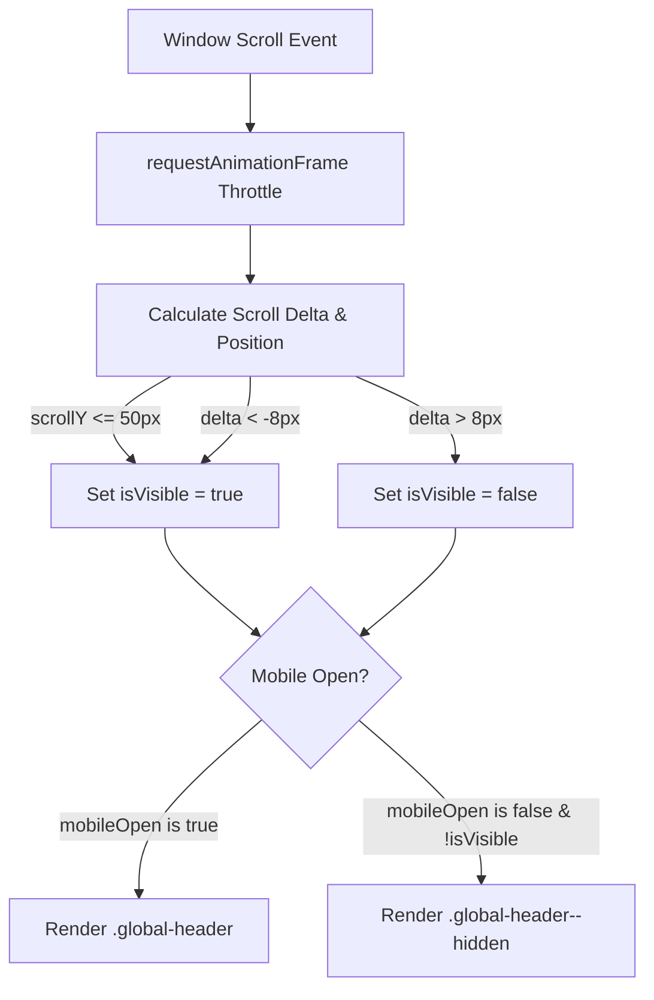

# Scroll-Aware Navbar Implementation Plan

> **For agentic workers:** REQUIRED SUB-SKILL: Use superpowers:subagent-driven-development to implement this plan task-by-task. Steps use checkbox (`- [ ]`) syntax for tracking.

**Goal:** Implement auto-hiding navbar on scroll down and reveal on scroll up (Instrument.com style) for `FocusLensNavbar`.

**Architecture:** A lightweight, passive scroll listener throttled with `requestAnimationFrame` calculates directional deltas. When scrolling down past 50px, the header slides up out of view via CSS `transform: translateY(-100%)`. When scrolling up or when near top, the header smoothly translates back into view. The mobile menu overrides hiding to remain accessible.

**Architecture Diagram:**



**Tech Stack:** React 18, CSS3 Hardware-Accelerated Transforms, Framer Motion, Lenis Smooth Scroll.

## Global Constraints
- Must not cause layout shift or interfere with Lenis smooth-scroll.
- Zero flicker or micro-jitter on trackpad gestures.
- Must keep navbar accessible and visible when mobile drawer is open.

---

### Task 1: Add Hardware-Accelerated CSS Transitions to `FocusLensNavbar.css`

**Files:**
- Modify: `src/components/FocusLensNavbar.css:6-18`

**Interfaces:**
- Produces: `.global-header--hidden` rule and CSS transition on `.global-header`.

- [ ] **Step 1: Update `.global-header` with transform transition and add hidden modifier class**

```css
.global-header {
  position: fixed;
  top: 0;
  left: 0;
  width: 100%;
  height: 52px;
  z-index: 1003;
  background-color: #ffffff;
  border-bottom: 1px solid rgba(0, 0, 0, 0.06);
  user-select: none;
  box-sizing: border-box;
  transition: transform 0.35s cubic-bezier(0.16, 1, 0.3, 1);
  will-change: transform;
}

.global-header--hidden {
  transform: translateY(-100%);
  pointer-events: none;
}
```

- [ ] **Step 2: Commit CSS changes**

```bash
git add src/components/FocusLensNavbar.css
git commit -m "style: add transform transition and hidden class for scroll navbar"
```

---

### Task 2: Implement RAF-Throttled Scroll Direction Hook in `FocusLensNavbar.jsx`

**Files:**
- Modify: `src/components/FocusLensNavbar.jsx:33-105`

**Interfaces:**
- Consumes: `window.scrollY`, `window.requestAnimationFrame`, `mobileOpen` state.
- Produces: `isVisible` state dynamically toggling `.global-header--hidden`.

- [ ] **Step 1: Add scroll listener and header class binding in `FocusLensNavbar.jsx`**

```jsx
// Add isVisible state
const [isVisible, setIsVisible] = useState(true)

useEffect(() => {
  let lastScrollY = window.scrollY
  let ticking = false

  const handleScroll = () => {
    if (!ticking) {
      window.requestAnimationFrame(() => {
        const currentScrollY = window.scrollY
        const delta = currentScrollY - lastScrollY

        if (currentScrollY <= 50) {
          setIsVisible(true)
        } else if (delta > 8) {
          setIsVisible(false)
        } else if (delta < -8) {
          setIsVisible(true)
        }

        lastScrollY = currentScrollY
        ticking = false
      })
      ticking = true
    }
  }

  window.addEventListener('scroll', handleScroll, { passive: true })
  return () => window.removeEventListener('scroll', handleScroll)
}, [])
```

Apply class on `<header>`:
```jsx
const shouldHide = !isVisible && !mobileOpen

return (
  <>
    <header className={`global-header ${shouldHide ? 'global-header--hidden' : ''}`}>
```

- [ ] **Step 2: Verify build and runtime syntax**

Run: `npm run build`
Expected: Build succeeds with 0 errors.

- [ ] **Step 3: Commit code changes**

```bash
git add src/components/FocusLensNavbar.jsx
git commit -m "feat: add scroll-direction detection to auto-hide and reveal navbar"
```
