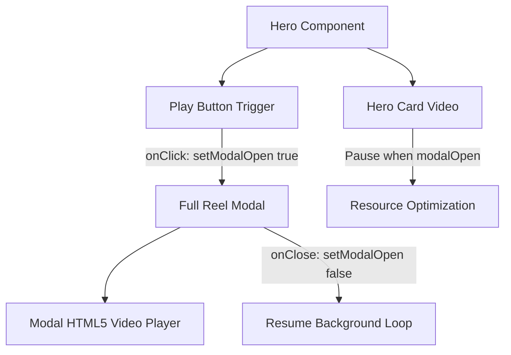

# Hero Section Custom Local Video Architecture — Design Spec

**Date:** 2026-10-01  
**Project:** Flo Studios Web Platform  
**Status:** In Review  

---

## 1. Overview & Objective

Replace the existing third-party Vimeo iframes in the Hero section with a local HTML5 video playback system. The user will place video files directly into `public/videos/`:
1. **Hero Background Card:** Silent, continuous ambient loop (`hero-loop.mp4` / `hero-loop.webm`) with poster fallback.
2. **Theater Modal Player:** Full-resolution reel video with audio and native controls (`hero-reel.mp4` / `hero-reel.webm`).

---

## 2. Requirements & Behavior

### 2.1 Hero Card Preview Loop
- Rendered using HTML5 `<video>` with `autoPlay`, `muted`, `loop`, `playsInline`.
- Sits inside `.hero__video-card` with `object-fit: cover` to maintain aspect ratio across viewports.
- Uses `poster="/instrument/hero-reel.jpg"` to prevent layout flash before video buffers.
- Pauses playback automatically when the modal theater opens to save system resources.

### 2.2 Full Reel Theater Modal
- Triggered by clicking the central Play button (`.hero__play-btn`).
- Opens a backdrop-blurred theater modal with a full-featured HTML5 `<video>` element.
- Configured with `controls`, `autoPlay`, `playsInline`, and audio unmuted.
- Closing modal via Escape key, close button, or backdrop click stops modal playback and resets time to 0.

### 2.3 File Organization & Fallback
- Standard directory: `public/videos/`
  - `hero-loop.mp4` (or `hero-loop.webm`)
  - `hero-reel.mp4` (or `hero-reel.webm`)
- A helper `public/videos/README.md` will document the supported file names, encodings (H.264 / VP9 / AAC), and recommended resolutions (1080p, 60fps / 30fps).
- If video files are missing, the video element gracefully falls back to the poster image without throwing uncaught runtime exceptions.

---

## 3. Component Architecture & Data Flow

### Component Changes:
- **`src/components/Hero.jsx`**:
  - Remove Vimeo `<iframe>` tags.
  - Add `cardVideoRef` and `modalVideoRef` refs.
  - Implement `<video>` elements with multiple `<source>` fallback tags (WebM + MP4).
  - Sync playback states: when modal opens, `cardVideoRef.current.pause()`; when modal closes, `modalVideoRef.current.pause()` and `cardVideoRef.current.play()`.
- **`src/components/Hero.css`**:
  - Replace `.hero__video-iframe` styling with `.hero__video-media` (`object-fit: cover`, `width: 100%`, `height: 100%`).
  - Add modal video container styling (`.hero-modal__video-player`) to optimize contrast, border-radius, and control visibility.

---

## 4. Testing & Verification Plan

1. **Format verification:** Verify MP4 and WebM source resolution in browser.
2. **Autoplay verification:** Ensure hero card video loops silently on desktop and mobile without user interaction.
3. **Modal interaction:** Test open modal -> background video pauses -> modal video plays with audio -> close modal -> modal video stops and background loop resumes.
4. **Vite build test:** Run `npm run build` to confirm zero lint or compilation errors.
